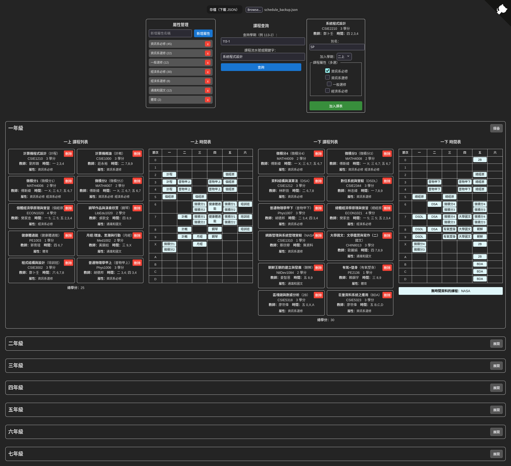

# NTU Course Planner

[](LICENSE)

這是一個為臺灣大學學生設計的課表規劃工具，很多課程每年都會開，上課時間不太會改變，學生可以提前規劃、避免衝堂，但一直盯著 Excel 拉時間、比對學分數真的太累了。這個工是使用 Vite + React 打造，支援跨學期課程管理、別名命名、課程屬性學分統計，並支援 JSON 匯入匯出。

線上使用（免安裝）：https://ntu-course-planner.vercel.app/

用戶每次搜尋課程時，會串接 [臺大新課程網](https://course.ntu.edu.tw/) 的 API，自動搜尋該學期符合關鍵字的第一個結果。用戶可選擇：

- 加入哪一個學期
- 指定課程屬性（例如「通識」、「資訊系必修」），雙輔可充抵的課可以選多個屬性
- 客製化課程別名（例如「DSA」取代「資料結構與演算法」）

建議先用課程網確認要加的課程名稱與學期，再使用本工具搜尋。

## 畫面預覽



## 開發者使用方式（本機執行）

```bash
git clone https://github.com/qwe1rt1yuiop1/NTU-Course-Planner
cd NTU-Course-Planner
npm install
npm run dev
```

歡迎大家隨時發 Issue 或 Pull Request，參與改進這個專案！
如果要套用到其他學校，應該只要修改 API（沒的話可能只能爬）和課程資料的格式，也歡迎使用這個工具的模板做修改。

## License

本專案採用 [MIT License](LICENSE)

